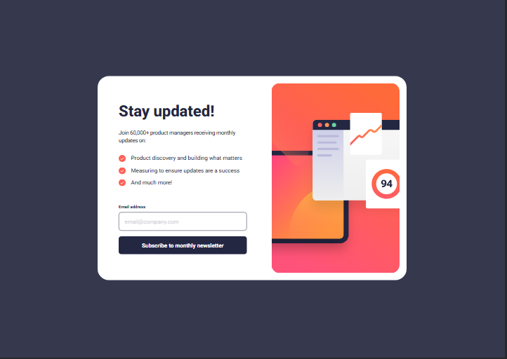

# Frontend Mentor - Newsletter sign-up form with success message solution

This is a solution to the [Newsletter sign-up form with success message challenge on Frontend Mentor](https://www.frontendmentor.io/challenges/newsletter-signup-form-with-success-message-3FC1AZbNrv). Frontend Mentor challenges help you improve your coding skills by building realistic projects. 

## Table of contents

- [Overview](#overview)
  - [The challenge](#the-challenge)
  - [Screenshot](#screenshot)
  - [Links](#links)
  - [Built with](#built-with)
  - [What I learned](#what-i-learned)
- [Author](#author)

## Overview

### The challenge

Users should be able to:

- Add their email and submit the form
- See a success message with their email after successfully submitting the form
- See form validation messages if:
  - The field is left empty
  - The email address is not formatted correctly
- View the optimal layout for the interface depending on their device's screen size
- See hover and focus states for all interactive elements on the page.

### Screenshot

### Links

- Solution URL: [https://github.com/NeeloByron/newsletter-sign-up-with-success-message-main.git](https://your-solution-url.com)
- Live Site URL: [https://neelobyron.github.io/newsletter-sign-up-with-success-message-main/](https://your-live-site-url.com)

### Built with

- Semantic HTML5 markup
- CSS custom properties
- Flexbox
- Mobile-first workflow
- Vanilla JavaSCript

### What I learned

- How to create a responsive layout that works on both mobile (375px) and desktop (1440px)
- How to implement form validation with custom error message
- How to toggle between form and success message states
- How to use CSS pseudo-elements for custom checkmarks
- How to handle email validation using regex

## Author

- Frontend Mentor - [@NeeloByron](https://neelobyron.github.io/newsletter-sign-up-with-success-message-main/)
- GitHub - [@NeeloByron](https://github.com/NeeloByron)

